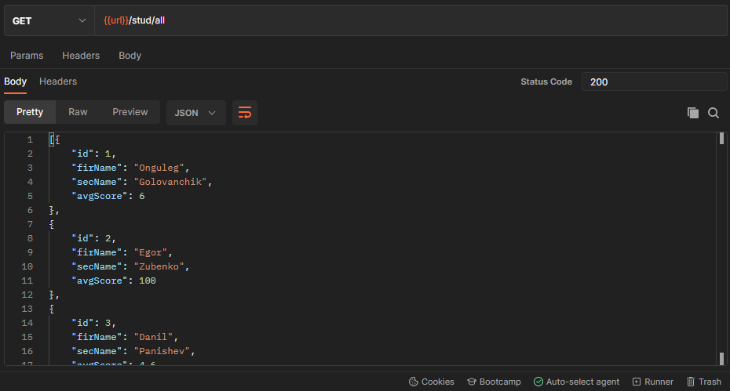
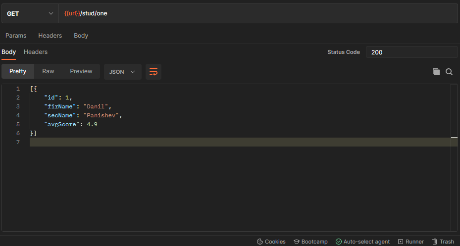
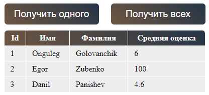
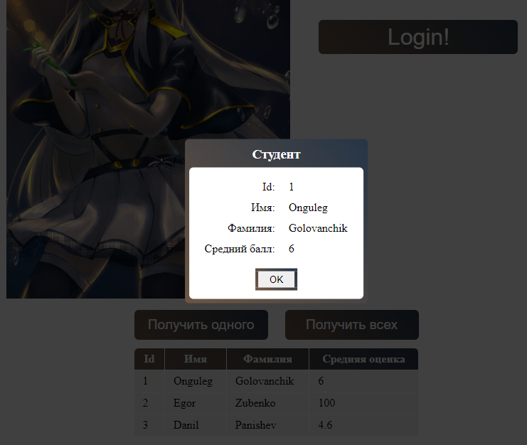

ФЕДЕРАЛЬНОЕ ГОСУДАРСТВЕННОЕ БЮДЖЕТНОЕ ОБРАЗОВАТЕЛЬНОЕ

УЧРЕЖДЕНИЕ ВЫСШЕГО ОБРАЗОВАНИЯ

«ВЯТСКИЙ ГОСУДАРСТВЕННЫЙ УНИВЕРСИТЕТ»

Институт математики и информационных систем

Факультет автоматики и вычислительной техники

Кафедра систем автоматизации управления

 

Дата сдачи на проверку:

«15» апреля 2022 г.

Проверено:

«__» апреля 2022 г.

Работа Vue с таблицами и модальными окнами

Отчет по лабораторной работе № 5

по дисциплине

«Web-программирование»

  

Разработал студент гр. ИТб-2301-01-00 ________________ /Панишев Д.А./

Проверил ст. преподаватель _________________ /Земцов М.А./

Работа защищена с оценкой	«___________» «___» __________ 2022 г.

   

Киров 2022  

---
Цель работы: создать таблицу, для которой будут подгружаться данные с mock-сервера, а также модальное окно с информацией.
  
Задачи:
1. реализавть таблицу, в которую будут поступать данные о студентах;
1. написать два get запроса для получения данных одного и нескольких студентов для таблицы с mock-сервера;
1. сдалть модальное окно, которое при нажатии на строчку таблицы будет выводить такую же информацию. 
  
## Ход работы
### Mock-сервер

Были сделаны два get запроса на сайте [Postman](https://www.postman.com/):
1. запрос с получением информации (id, имя, фамилия, средний балл) о трех студентах (рисунок 1);
1. запрос с получением информации об одном студенте (рисунок 2).

Рисунок 1 - Запрос с тремя студентами

Рисунок 2 - Запрос с одним студентом

2

---
### Get запросы с помощью Axios
Были написаны два get запроса с получением данных. Они активировались только после нажатия одной из двух кнопок, каждая из которых отвечает за свой запрос.

Листинг двух запросов:

    findAll() {
        axios
            .get(`${this.url}/all`)
            .then((res) => {
            console.log(res.data);
            this.list = res.data;
            })
            .catch((err) => {
            console.log(err);
            });
    },
    findOne() {
        axios
            .get(`${this.url}/one`)
            .then((res) => {
            console.log(res.data);
            this.list = res.data;
            })
            .catch((err) => {
            console.log(err);
            });
    },

3

---
### Таблица
Была реализована таблица с четырмя столбцами. Для получения данных в таблицу были сделаны две кнопки для получения информации об одном и нескольких студентах соответсвенно. Скриншот представлен на рисунке 3.

Рисунок 3 - Таблица, с уже полученными данными

По умолчанию таблица пуста. Ее контент появляется только после нажатия на одну из кнопок. При их повторном нажатии контент обновляется.

4

---
### Модальное окно
Было сделано модальное окно, которое дублирует информацию из таблицы при нажатии на одну из строк. Скриншот окна представлен на рисунке 4.

Рисунок 4 - Модальное окно

При нажатии на кнопку 'ОК' окно закрывается.

Листинг всего пакета Table.vue представлен в приложении А.

Вывод: была реализована таблица, в которую по кнопке поступают данные с mockc-сервера, и при нажатии на строку появляется модальное окно, дублирующее информацию из выбранной строки.

5

---

<b>Приложение А</b>

(обязательное) 

<b>Листинг файла Table.vue</b>  

    <template>
    

        

        <button @click="findOne()" class="getter">Получить одного</button>
        <button @click="findAll()" class="getter">Получить всех</button>
        

        <table class="main-table">
        <tr>
            <th>Id</th>
            <th>Имя</th>
            <th>Фамилия</th>
            <th>Средняя оценка</th>
        </tr>
        <tr v-for="stud in list" :key="stud.id" @click="setField(stud.id)">
            <td>{{ stud.id }}</td>
            <td>{{ stud.firName }}</td>
            <td>{{ stud.secName }}</td>
            <td>{{ stud.avgScore }}</td>
        </tr>
        </table>

        

        

            

            <h3 style="margin: 0 0 8px 0; color: white">Студент</h3>
            

            

            <table class="modal-table">
                <tr>
                <td>Id:</td>
                <td>{{ id }}</td>
                </tr>
                <tr>
                <td>Имя:</td>
                <td>{{ firName }}</td>
                </tr>
                <tr>
                <td>Фамилия:</td>
                <td>{{ secName }}</td>
                </tr>
                <tr>
                <td>Средний балл:</td>
                <td>{{ avgScore }}</td>
                </tr>
            </table>

            <button @click="closeModal()" class="closer">OK</button>
            

        

        

    

    </template>

    

    

6

---